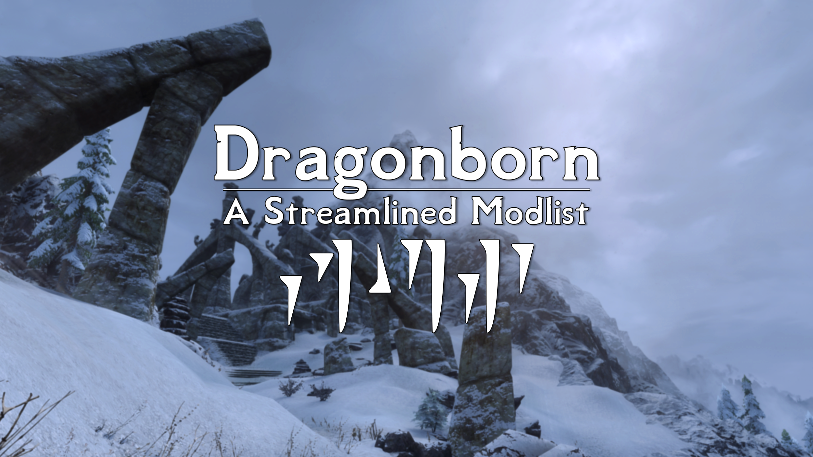

---

  <a href="https://www.nexusmods.com/skyrimspecialedition/mods/80877">Nexus Page</a> ·
  <a href="README.md">Installation</a> ·
  <a href="GAMEPLAY.md">Gameplay Guide</a> ·
  <a href="CONFIGURATION.md">Configuration</a> ·
  <a href="CHANGELOG.md">Changelog</a> ·
  <a href="ADDONS.md">Addons</a> ·
  <a href="HELP.md">Help</a>

---

# Changelog

## Version 1.1.0 [Unreleased]

In this update, I wanted to re-do the creation club integration a little bit to restore as many of the CC quests as possible. I don't think it's fair to just remove them entirely and I'd rather see them rebalanced or reworked where I can.

### Added
+ Rebalancing AE - Quest Requirements (This now serves as the primary balancing method for AE Quests)
+ Bruma Clutter for Skyrim Imperials
+ Sexier Vanilla - Civil War Champions (Custom patch to restore quest)
+ Redguard Elite - Reintegration (Custom patch to restore quest)

### Updated
+ Manbeast to 2.0!!!
+ Scion 2.1
+ Ghosts of The Tribunal - Reduced Cut (Switched to keep quest version)
+ Mysticism
+ Adamant
+ Base Object Swapper
+ Natura
+ Lunaris

### Removed
+ The Cause - Reduced Cut (Want to keep CC Quests)
+ Homes Under the Warhammer (Covered by RAE Quest Requirements)
+ Fishing - Reduced Cut (Was just not necessary really)

## Version 1.0.27

### Added
+ Enhanced Reanimation
+ CC's Camping Expansion
+ Skyland - Happy Little Trees
+ Innocence Lost - Quest Expansion
+ Capitals and Towns of Skyrim

### Updated
+ Dyndolod and TexGen Outputs

## Version 1.0.26

### Added
+ Dynamic Animation Replacer (Until OAR is out)
+ Underdog Animations - Custom Cut
+ Custom Tamrielic Distribution - Moon and Star Patch

### Updated
+ Press H To Horse

## Version 1.0.25

### Added
+ Draugr Warhounds
+ Follower Trap Safety

### Fixed
+ Fixed issue with Malkoran's outfit

## Version 1.0.24

### Added
+ Immersive College NPCs + Custom Ultralite Patch
+ Dragonbroth Stew Mod :)

## Version 1.0.23

### Added
+ Blade and Blunt - Vanilla Difficulty Modifiers (Optional)
+ College of mages - ELFX Patch

## Version 1.0.22

### Added
+ Weather is Sacred ENB
+ Saints and Seducers - Mysticism Rebalance + ECSS Patch
+ The Cause - Mysticism Rebalance
+ HD Reworked Horses
+ Vigil Enforcer - Mysticism Consistency

### Removed
+ Performance ENB (Replaced by new one)

## Version 1.0.21

### Added
+ Radiant Requirements - MCM
+ Enhanced Blood Textures
+ KS Hairs Lite
+ Vanilla Hair for KS Hairs
+ Sforzinda Destinations (Additional carriage stops)
+ HD Reworked Horses

### Fixed
+ Load order issue with bogmort apothecary patches

## Version 1.0.20

### Added
+ Missile's Apothecary Patches
+ New Armory - Elven Steel (Custom Cut)
+ Bogmort - Bog Monsters
+ Faction Pit Fighter + Travels
+ Faction - Pit Fighter Revamped
+ Moon and Star USSEP Dock Fix
+ Better Lighting for Moon and Star
+ Sunder and Wraithguard Vault Fix

## Version 1.0.19

### Added
+ Cathedral - Armory (BSA Packed)

### Removed
+ Modular Armory (Caused Crashes with certain armor)
+ Whispering Door Quest Expansion :(((

### Fixed
+ Enthir should now properly sell mysticism destruction spells

## Version 1.0.18
### Added
+ Beyond Skyrim Bruma - CC Zombie Consistency
+ Instinct - Animal Taming

## Version 1.0.17

### Updated
+ Reworked Timing is Everything Config
+ Forceful Tongue - Shouts Overhaul

## Version 1.0.16

### Added
+ Custom Natura and Lunaris Integration
+ Bandit Spellswords

## Version 1.0.15

### Added
+ Custom Balance patch for Dragonplate CC and Headsman's Cleaver CC
+ Fearsome Fists - Thaumaturgy Patch
+ Bandit Brawlers - Fearsome Fists Patch
+ Bandit Brawlers - Hand to Hand Patch

## Version 1.0.14

### Fixed
+ Fixed all NPC Facegen and hair

## Version 1.0.13

### Added
+ Press H to Horse
+ Custom Alcohol Crafting Recipes
+ Craftable Lockpicks
+ Craftable Scrolls

### Updated
+ Packed Terrain LOD into BSA
+ Natura and Adamant Patch

### Fixed
+ Fixed Scrambled Bugs Settings
+ Fixed purple high hrothgar wind

## Version 1.0.12

### Added
+ Constructible Object Custom Keyword System
+ Cathedral - 3D Nightshade
+ Remember Lockpick Angle (Perk Version)
+ Wider MCM Menu

### Fixed
+ Draugr chests no longer contain excessive amounts of enchanted gear
+ Sprint should be working fully on controllers now
+ Removed duplicate falmer blood elixir dialogue

### Removed
+ Shrubs Redone AIO (Wasn't really needed)

## Version 1.0.11

### Added
+ Lunaris
+ Natura
+ Antiquary
+ Improvement Names Customized (Was missing oops)
+ Creation Club - Adjustments Rebalancing and Variants

### Fixed
+ Fixed issue with missing PO3Tweaks ini

## Version 1.0.10

### Added
+ Reshade Setup and Davinci Reshade
+ HQ Vanilla Tiny Rocks + Complex Grass Support
+ Completely redid pine forest grass
+ Added Nemesis Back for those who need it
### Fixed
+ Pressing ESC now properly closes current menu

## Version 1.0.9

### Added
+ Coherent Inn Prices + Bruma Patch
+ Today's Menu

### Updated
+ Rebuilt LODGen and updated world map
### Fixed
+ Fixed Veydosebrom grass for non ENB users
+ Fixed scrambled bugs for those on less than windows 10

## Version 1.0.8

### Updated
+ Updated to latest SKSE and removed Stock Game

## Version 1.0.7

### Added
+ Nordic Faces - Immersive Character Overhaul
+ Iconic Statues

### Updated
+ Scrambled Bugs Config JSON
+ Rebuilt all facegen
+ Rebuilt all terrain LOD

## Version 1.0.6
### Added
+ Bow of Shadows - Reduced Cut
+ Dust Effects by HHaleyy
+ Rugnarok
+ Peltapalooza
+ Rustic Cooking
+ Rustic Windows
+ JS Dragon Claws SE
+ JS Rumpled Rugs

## Version 1.0.5
### Added
+ Craftable Blood Potions
### Fixed
+ Mysticism + Adamant Load order Issue (oops)

## Version 1.0.4
### Added
+ Ruins Clutter Improved + Fixes Patch
+ Hvergelmir's Aesthetics - Beards
### Removed
+ Movement Behavior Overhaul
### Fixed
+ Weapon draw after sprinting was bugged

## Version 1.0.3
### Added
+ Glorious Doors of Skyrim
+ Rustic Clutter Collection

## Version 1.0.2

### Added
+ NARC Remade
+ No Sun Damage in Soul Cairn
+ Simple Werewolf Howls Menu
+ Favorite Misc Items
+ Sensible Sleepwalking
+ Scion - Vampiric Sunscreen Patch (Optional)

### Updated
+ Redoran - Realistic Water Two Patch

## Version 1.0.1

Adding some last minute quest changes I forgot about :)

### Added
+ A Lovely Letter Alternate Routes
+ Buyable Golden Claw
+ Finding Derkeethus
+ Finding Susanna Alive
+ Finding Helgi... and Laelette
+ Finding Velehk Sain
+ Missing in Action Delayed
+ Sit on Stuff
+ Sweeping Organizes Stuff

### Updated
+ Wyrmstooth - Mysticism Consistency Patch (From Nexus)

## Version 1.0.0

Full release is out on the nexus [here](https://www.nexusmods.com/skyrimspecialedition/mods/80877) and on the Wabbajack UI under unofficial lists. Enjoy!

### Added
+ Ancient Knowledge - Automaton Summoning
+ Collect Bodies and Bear Traps
+ Wyrmstooth - Mysticism Consistency Patch

## Version 1.0.0-BETA3
### Added
+ Immersive Dungeons
+ EasierRiders Dungeons
### Removed
+ Enhanced Landscapes (Too many conflicts)

## Version 1.0.0-BETA2
### Added
+ Expressive Facegen Morphs
+ Expressive Facial Animations (Male and Female)
+ Movement Behavior Overhaul
+ Toggle Compass Hotkey
+ Nordic Carved Clipping Fix
+ Morehud + Inventory Edition

### Updated
+ Animation Motion Revolution

### Fixed
+ NPCS No Longer Ice-skate walk

## Version 1.0.0-BETA1
Brand new :)
