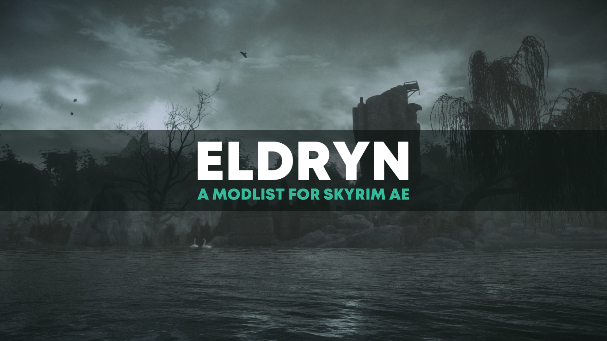

---

  <a href="https://www.nexusmods.com/skyrimspecialedition/mods/94412">Nexus Page</a> ·
  <a href="README.md">Installation</a> ·
  <a href="GAMEPLAY.md">Gameplay Guide</a> ·
  <a href="CONFIGURATION.md">Configuration</a> ·
  <a href="CHANGELOG.md">Changelog</a> ·
  <a href="ADDONS.md">Addons</a> ·
  <a href="HELP.md">Help</a>

---

# Changelog

## Will a save from version X be safe with version Y?

All modlists in the Animonculory use semantic versioning which translates to the following:

- 2.0.0.x are save game safe

- 2.0.x are save game safe

- 2.x.0 definitely requires a new save game

- x.0.0 definitely requires a new save game

## Will saves from one beta version be safe with another beta version or the full release?

Very unlikely. Do not ask if beta saves will be save-safe.

The purpose behind beta versions is for playtesting to help Foamimi and the team find and squash bugs before a major release, and squashing bugs often includes removing misbehaving mods which in turn breaks saves.

The Eldryn team would like to thank everyone who plays beta versions and reports issues with the understanding that their saves will not be safe. You are making the modlist better for our entire community.

## Version 2.1.0 [UNRELEASED] - NO ETA.

- Added SkyUI SE - Difficulty Persistence Fix
- Added Simple Mod Item Spawner
- Updated Crash Logger SSE AE VR
- Updated PapyrusUtil SE - Modders Scripting Utility Functions
- Updated powerofthree's Papyrus Extender
- Updated JContainers
- Updated Spell Perk Item Distributor (SPID)
- Updated Fuz Ro D-oh - Silent Voice
- Updated More Informative Console
- Updated SSE Display Tweaks
- Updated MCM Helper
- Updated RaceMenu
- Updated Constructible Object Custom Keyword System
- Updated Auto Input Switch
- Updated ConsolePlusPlus
- Updated Equip Enchantment Fix
- Updated DynDOLOD DLL - SKSE64 Plugin
- Updated Survival Mode Improved - SKSE
- Updated Simple Dual Sheath
- Updated Immersive Equipment Displays
- Updated Conditional Expressions Extended
- Removed Trainwreck - A Crash Logger
- Removed Backported Extended ESL Support
- Removed SkyUI - Flashing Savegames Fix
- Removed SkyUI - Ghost Item Bug Fix
- Removed Fix Note Icon for SkyUI
- Removed AddItemMenu
- Removed AddItemMenu - NG
- Removed Improved Alternate Conversation Camera (goodbye my sweet prince...)
- Removed Improved Alternate Conversation Camera - Redoran Settings
- - - - - - - - - -

## Version 2.0.0.5

- Added SMIM Minewood HD Texture Replacer
- Added Legacy of the Dragonborn Wraithguard Patch
- Added The Gift of Saturalia - A Quest for the Holidays
- Removed Chanterelle Alternate Start option
- Removed Beyond Skyrim - Bruma - Unofficial Fixes
- Fixed installation issues with Rare Curious (CC)
- Fixed various freezes!!
- Fixed snowed-in entrance at Raven's Rest
- Fixed grass clipping around the unmarked bandit camp south of the Guardian Stones
- Fixed floating health potion outside of Erikur's house
- Fixed floating icicles below the College of Winterhold's bridge (debris will be fixed another time)
- Fixed flickering in ASLAL start room
- Fixed flickering in Dragonsreach
- Fixed clipping objects in the Winking Skeever
- Tweaked ASLAL - Redoran Cut to remove certain starts
- Tweaked Rudy ENB to be slightly brighter
- - - - - - - - - -

## Version 2.0.0.4

- Added Mari's Flora Texture Tweaks
- Updated Gore
- Updated Dynamic Random Spell Idle
- Updated Description Framework
- Updated Trainwreck - A Crash Logger
- Updated Immersive folded hands (OAR)
- Removed No Grassias - A Universal Grass Fix For Grass Mods
- Removed Streamlined Fishing - Rod Selection Menu
- Removed Autumngate - A Believable Player Home
- Fixed missing textures for Juniper Berries
- Fixed gap between certain masculine sets from Common Clothes and Armors
- Fixed CTD at startup, along with remaining installation issues
- - - - - - - - - -

## Version 2.0.0.3

- Added Godd Statue
- Added Improvement Names Customized AE
- Added Warmage of Shornhelm - Redone Spell Knight Armor for Thamauturgy
- Updated Simplicity of Snow
- Updated Madness and Order - Artifacts
- Updated Legacy of the Remnants
- Updated Descriptions for Various Mods
- Updated Dynamic Follower Weakening (SPID) - Eldryn Config
- Fixed CTD at startup (dangit Todd)
- - - - - - - - - -

## Version 2.0.0.2

- Fixed installation issues/halts (FOR REAL THIS TIME!)
- - - - - - - - - -

## Version 2.0.0

The **HDT-SMP Armor Addon is CURRENTLY UNSUPPORTED!** I do not have space on my computer to have a separate instance of Eldryn installed, so I cannot test it with the current version of the guide as of now.

- Additional highlights include;
  - Northern Scenery Overhauls
  - Unique Locations - Riverwood Forest
  - Northern Vanilla Farmhouses
  - Distinct Interiors
  - FrozenLands
  - AI Overhaul
  - Madmen - A Forsworn Overhaul
  - Lawless - A Bandit Overhaul
  - Haugbui - A Draugr Overhaul
  - Finding Helgi and Laelette
  - Finding Susanna Alive
  - Finding Derkeethus
  - Finding Velehk Sain
  - Zim's Trainers Expansion
  - Search and Seizure - Quest Expansion
  - Blood on the Ice Redux
  - Gift of the Underking
  - Legacy of the Remnants
  - Menagerie - A Creation Club Pet Overhaul
  - Chanterelle - a Savage World to Explore
  - Hammet's Dungeon Pack 1
  - Hammet's Dungeon Pack 2
  - NordWarUA's Armor Variants
  - New Armory Series - Ashen Weapons
  - Sleek Wolf Armor - Standalone
  - Lunar Guard Armor
  - Ducks and Swans
  - Hungers
  - Durzogs
  - Shalks
  - Shroom Beetles
  - Default Face NPCs Fixed
  - NITHI NPC Enhancement - The Reach
  - Children of the Pariah - An Orc NPC Overhaul
  - Pandorable's NPCs - Sovngarde
- - - - - - - - - -

## Version 1.4.0

The HDT-SMP Armor Addon has been updated.

- No changelog is available for this update, as I rebuilt around v1.2.2.
- - - - - - - - - -

## Version 1.3.1

**NOTES** - You may receive a pop-up about missing plugins. **These notifications are safe to ignore**. 

No update is needed for the HDT-SMP Armor Addon.

- Added CBBE Conversions for Beyond Skyrim - Bruma
- Added Beard Mask Fix - Beards Use Slot 44 SKSE Plugin
- Updated Unofficial Skyrim Modder's Patch - USMP
- Updated Unofficial Skyrim Modder's Patch - USMP - Patch Emporium
- Updated Natura
- Updated Lunaris
- Updated BnP - Female Skin
- Updated BnP - Male Skin
- Updated Additional Dremora faces
- Updated Dremora Lines Expansion
- Updated Armory of the Dragon Cult - Dragon Priest Armor
- Updated Edgar Preset for HIMBO - Eldryn Edition
- Tweaked SSE Display Tweaks to disable player/actor camera fade effect
- Fixed freezing in High Hrothgar
- Fixed incorrect file name for AW Mosaic Male Skin (HIMBO) - Reverted Vampire Diffuse Map
- Fixed broken Ancient Shrouded Cowl and Shrouded Cowl masks
- - - - - - - - - -

## Version 1.3.0.2

No update is needed for the HDT-SMP Armor Addon.

- Updated Immersive Equipment Displays
- Updated UNSLAAD - Dragonslayer Armor Mesh Edit
- Reverted update to Nordic Tent upgrade by Pfuscher to prevent crashing near caravans
- Fixed Vigilant - Unslaad - Glenmoril - xVASynth Voiced from not having all available voices installed
- Fixed Shady Sam's mismatched face from ASLAL
- - - - - - - - - -

## Version 1.3.0.1

No update is needed for the HDT-SMP Armor Addon.

- Removed CK scripts.zip that snuck its way in
- - - - - - - - - -

## Version 1.3.0

The HDT-SMP Armor Addon has been updated.

- Artificer - An Artifact Overhaul
- Artificer - An Artifact Overhaul - I4 Patch
- Aljo's Artificer Patches
- Artificer - Xavbio Textures - CBBE Refit
- Artificer - Xavbio Textures - HIMBO Refit
- ArteFakes - Unique Artifacts Replacer
- Immersive Load Screens for ArteFakes
- RUSTIC AMULETS - Special Edition
- FleshFX
- FleshFX Patches for Simonrim
- SavrenX Solstheim Creatures
- Zombies Retexture - Desaturated and Less Wet
- UNSLAAD
- UNSLAAD - Settings Loader
- Unslaad - Delayed Start
- UNSLAAD Voiced - English Addon
- UNSLAAD Music Extended
- Unslaad Weapons and Armors Retexture
- Unslaad Hoarfrost Knight Tweaks and Fixes
- UNSLAAD - Hoarfrost Knight Armour and Helmet Tweaks and Fixes - Textures Path Updated
- UNSLAAD - Dragonslayer Armor Mesh Edit
- GLENMORIL
- GLENMORIL - English Translation
- GLENMORIL - Settings Loader
- Glenmoril - Delayed Start
- GLENMORIL - Book Covers
- Glenmoril Armors and Weapons Retexture
- Glenmoril Gun Replacer
- GLENMORIL - NPC Overhaul
- GLENMORIL - Patches
- Throw Item Animation for Glenmoril (DAR)
- Katana - Journey in the Shadows
- Custom Ruins in Soul Cairn
- Praedy's Soul Cairn - SE
- Praedy's Soul Cairn - SE - Chest Light Fix
- Missile's Apothecary Patches
- aljos Apothecary Patches
- Patch for Project AHO and Apothecary - An Alchemy Overhaul
- Disable screen shake effect.
- Dragon Priests Retexture SE
- Leon S. Kennedy - Standalone Follower (HIMBO) (I do what I please!)
- My Home is Your Home - Blank Name Fix
- Throw Stone -- Simple Distraction Tool (Enhanced)
- Sentinel - An Equipment Overhaul
- Sentinel - Patch Page - Adamant
- Sentinel - Reverted Guards and Stormcloaks
- Pandorable's Dunmer Damsels
- Clockwork - Silent Shadow Siren
- Northbourne NPCs Resources
- Vigilant - No Free Library Books
- Additional Dremora faces
- Additional Dremora faces - My optimized textures
- Dremora Lines Expansion
- Cathedral - Mushrooms
- Skyrim Remastered - Metal Cages and SMIM Imperial Jails
- 2K Tendril Vines
- RUGNAROK - Special Edition (was using the 1K version before)
- DynDOLOD DLL
- Armory of the Dragon Cult - Dragon Priest Armor
- King-Priest - Enhanced Dragon Priests
- Apothecary 1 Second Restore - Eldryn Cut
- USSEP Caravan Stuck Fix for VSMO

### Updated

- Mind of Madness Bald Fix
- Gore
- Desecration
- Abyss
- Arcane
- Arclight
- Vulcano
- Stellaris
- Necrom
- Flames of Coldharbour
- Bloodmoon
- Lunaris
- Natura
- Skyrim on Skooma
- Container Item Distributor (CID)
- Cities of the North - Dawnstar Patch Collection
- lilebonymace's patches and xEdit scripts
- JK's Interiors Patch Collection
- JK's Guild HQ Interiors Patch Collection
- Foamimi's Salt and Wind Retexture Hub
- Spell Perk Item Distributor (SPID)
- powerofthree's Tweaks
- Northbourne NPCs of Whiterun Hold
- Spaghetti's Faction Halls - Companions
- Follower Distance Tweaks
- Skyland AIO
- Skyland Bits and Bobs
- Candlehearth - Unofficial Patches
- Unofficial eFPS patches
- Hand to Hand - An Adamant Addon
- Apothecary - An Alchemy Overhaul
- Adamant - A Perk Overhaul
- Mysticism - A Magic Overhaul
- Thaumaturgy - An Enchanting Overhaul
- Starfrost - A Survival Overhaul
- Baited - A Fishing Artifact Overhaul
- VIGILANT
- VIGILANT Voiced - English Addon
- NPC Animation Remix (OAR)
- DynDOLOD 3 Alpha
- DynDOLOD Resources
- Unaggressive Dragon Priests Fix
- Navigator - Navmesh Fixes
- Nordic Tent Upgrade by Pfuscher
- Particle Patch for ENB

### Removed

- Vestige - An Artifact Overhaul
- Particle Lights for ENB - Riekling Outposts
- Masks of the Dovah Sonaak
- Frankly HD Miraak
- Silent Skill and Level Up Sounds
- Wyrmstooth Suleyk Retexture
- Ring of Namira - Improved
- Particle Lights for ENB - Luminous Ground Cover
- Realms of Oblivion - Survival Mode Consistency - S&S (CC)
- Realms of Oblivion - Survival Mode Consistency - VIGILANT
- JS Common Cages
- VIGILANT - JS Common Cages Patch
- Chanterelle (goodbye old friend...)
- No Ore Markers for Chanterelle
- Wild Horses of Chanterelle
- KYNE'S HUNT - A Quest for Chanterelle
- CC Zombies Retexture
- Guards and Stormcloaks Armors Retexture - HIMBO Refit

### Misc

- Fixed mismatching soul husk textures
- Fixed floating windows at Old Hroldan Inn
- Fixed floating windows in Windhelm
- Fixed misaligned stormcloak sleeves for feminine characters
- Fixed misaligned bandit/fur shoes for masculine characters
- Fixed misaligned wrists via studded/hide/fur cuirasses for feminine characters
- Tweaked entrance to Jarl Elisif's bathroom to be locked by default
- Tweaked bloom settings for Pi-Cho Quality and Pi-Cho Performance
- Moved Obsidian Weathers Addons and Required Files to ENB OPTIONS section
- - - - - - - - - -

## Version 1.2.2

- Added Civil War Champions - Reduced Cut
- Added ULTRAWIDE UI FIX (32 to 9 aspect ratio)
- Added 32 to 9 ULTRAWIDE Skyrim Main Menu Background Replacer
- Added Constructible Object Custom Keyword System - Widescreen Fixed - 21-9
- Added Constructible Object Custom Keyword System - Ultrawide - 32 x 9 Patch
- Added Tel Mithryn Overhaul - High Poly and Improved Meshes
- Added High Poly Solstheim Mushroom Trees
- Added Mind of Madness Bald Fix
- Added JLL' s Tel Mithryn
- Updated Crash Logger SSE AE VR
- Updated Navigator - Navmesh Fixes
- Updated Container Item Distributor
- Updated Gore (WOO!)
- Updated GORE - Miscellaneous Patches
- Updated Gore - Romance Dialogue Expansion
- Updated Follower Distance Tweaks
- Updated Immersive folded hands (OAR)
- Updated NPC Animation Remix (OAR)
- Fixed broken wedding ceremony pathing
- Fixed broken fur shoe meshes for masculine characters
- Fixed doubled windows at the Thalmor Embassy
- - - - - - - - - -

## Version 1.2.1

**NOTES** - You may receive a pop-up about missing plugins. **These notifications are safe to ignore**.

- Added Baited - A Fishing Artifact Overhaul
- Added Kill Caps Lock NG
- Added Leviathan Animations II - Greatsword Sneak Locomotion And Attacks
- Added Madness and Order
- Added Forsworn Armors and Weapons Retexture SE
- Added Paired Animation Improvements
- Added Container Item Distributor (CID)
- Added Purchasable CC Camping Supplies (CID)
- Added Flawn's Vanilla Argonians Redux (UNP - CBBE - HIMBO)
- Added Skin Feature Overlays SE - Freckles Scars Birthmarks Stretch Marks Moles
- Added FA ORCODONTIST - Orsimer Mouth and Teeth Fix
- Added Shiny ENB Eyebrows Begone
- Added ENB Shiny Beard Fix
- Added VIGILANT - JS Common Cages Patch
- Added Medieval Spirits - Empty Hearthfire Wine Bottles Patch
- Added Show Follower Carry Weight
- Added Less Visually Obtrusive Cloak Spell Effects
- Updated VIGILANT
- Updated VIGILANT Voiced - English Addon
- Updated PhotoMode
- Updated Candlehearth - An Inn Overhaul
- Updated Nether's Follower Framework
- Updated Sure of Stealing
- Updated Kaidan 2 Extended Edition
- Updated Vestige - An Artifact Overhaul
- Updated Base Object Swapper
- Updated Keyword Item Distributor (KID)
- Updated Glenmoril Unslaad and the unvoiced parts of Vigilant xVASynth Voiced
- Updated Open Animation Replacer
- Updated Unofficial eFPS Patches
- Updated Navigator - Navmesh Fixes
- Updated Serana Dialogue Add-On Patch Hub
- Updated Foamimi's Redoran Presets
- Removed Feminine Argonian Textures (CBBE)
- Removed Masculine Argonian Textures (HIMBO)
- Removed GORE - Pink-ified (won't work anymore with the upcoming version)
- Removed Eldryn Edition - Gigachad Presets (included in the updated version of my Redoran preset page)
- Removed Belt-Worn Dragon Priest Masks - WACCF Patch
- Fixed Inigo's ebony bow from having a rainbow, oil-like cubemap appearance
- Fixed aging maps via BnP from being overwritten
- Tweaked BnP for males facial normal maps
- Made consistency patches for NPC overhauls to have more defined wrinkles (huzzah!)
- Reverted Gore's two-handed drawn idle animations so they last longer/don't reset as frequently (he'll still be a poser with his sword over his shoulders, but it'll occur more consistently rather than him lowering his weapon while it's still drawn after like 3 seconds)
- - - - - - - - -

## Version 1.2.0.1

- Removed VIGILANT - Divine Crusader Addon

- - - - - - - - -

## Version 1.2.0

**NEW** - [Eldryn Extended - HDT-SMP Armor Addon](https://github.com/Foamimi/Eldryn-Extended---HDT-SMP-Armor-Addon) by Foamimi

### Added

- Gore - Vigilant (it's here!)
- Crystal Mudcrabs
- Apothecary - An Alchemy Overhaul
- Starfrost - A Survival Overhaul
- Gourmet - A Cooking Overhaul
- Gourmet Patch Page
- Missile's Gourmet Patches
- Gourmet - Beyond Skyrim - Wares of Tamriel Patch
- Candlehearth - An Inn Overhaul
- Candlehearth - An Inn Overhaul and Cities of the North (COTN) Patch
- EVG Animated Traversal
- SkyClimb
- SkyClimb - Settings Loader
- SkyClimb - No Marker (thank you Squeegee!)
- Pandorable's Sebastian
- Pandorable's Joseph
- Hendraheim - Creation Club Patches
- Dressed Hearthfire Doll
- FYX - Water Mesh Optimization
- Survival Mode (CC) - Cloaks of Skyrim Patch
- Rare Curious (CC) - Poison Apple Texture Swap Fix
- Hunt vampires as a vampire - do dawnguard questline as a vampire
- Darenii Spell Packs - Drop Rate Nerfs
- Dust Effects by HHaleyy
- Vanilla Script (micro)Optimization 1.16a - Adoption Bug Fix
- Argonian and Khajiit Teeth Fix
- Hendraheim Hall Stability
- Tundra Homestead Stability
- Spaghetti's Faction Halls - Thieves Guild
- JK's Temple of Dibella
- JK's Temple of Kynareth
- JK's Temple of Talos
- JK's Temple of the Divines
- JK's Temple of the Divines Lite
- JK's Castle Dour
- Mania Mushroom Retextured (Saints and Seducers CC)
- CC's Camping Expansion
- CC's Camping Expansion - Settings Loader
- Unofficial Beyond Skyrim Bruma Camping (CC) Patch
- Assorted Animation Fixes
- DyndoLOD FX Glow Accurate Disabler - Quality of Life
- Better SMIM Junipers
- Reach Trees Enhanced
- Windhelm Docks Map Marker
- Myrwatch - Tweaks and Enhancements
- Creation Club Basket Distribution - Base Object Swapper (BOS) (only the Forgotten Retex Project patch)
- Unique Festival Ropes
- Simply Order Summons
- Swiftly Order Squad - Follower Commands UI
- Swiftly Order Squad Icon Replacements
- Nether's Follower Framework
- Nether's Follower Framework - Settings Loader
- Vampire Armors and Weapons Retexture SE
- Guards and Stormcloaks Armors Retexture SE
- Guards and Stormcloaks Armors Retexture - 3BA and HIMBO bodyslides
- Load Screen Shading Fix
- BnP Male Skin (HIMBO)
- CC Farming Rebalanced

### Updated
- VIGILANT - Divine Crusader Addon
- Lockpicking for Barbarians
- Assorted Mesh Fixes
- Navigator - Navmesh Fixes
- Sure of Stealing
- Mysticism - A Magic Overhaul
- Unofficial Skyrim Creation Club Content Patches
- Survival Mode Improved - SKSE
- GORE - Miscellaneous Patches
- Immersive Equipment Displays
- Keyword Item Distributor (KID)
- VIGILANT Voiced - English Addon Subtitle Patch
- lilebonymace's patches and xEdit scripts
- Unofficial Skyrim Modder's Patch - USMP SE
- Headhunter - Bounties Redone
- Kaidan 2 Extended Edition (it's here!)
- Flute Animation Fix
- Simplicity of Snow
- Lux Orbis Misc Patches
- Use Those Blankets
- Word Wall Transparency Fix for ENB
- XP32 Maximum Skeleton Special Extended
- Vulcano
- Gore
- Remiel
- Stormcrown - A Shout Overhaul
- Mundus - A Standing Stone Overhaul
- Aetherius - A Race Overhaul
- Blade and Blunt - A Combat Overhaul
- JK's Dragonsreach
- Security Overhaul SKSE - Lock Add-ons
- Wild Horses of Chanterelle
- Nordic Feel - Realistic Bodyslide for CBBE - Eldryn Edition

### Removed
- Soul Cairn Script Tweaks
- Alchemy Plus - Better Models and Names
- Dungeon - An Encounter Overhaul
- Apothecary - Food and Drink Addon
- Reverb Interior Sounds Expansion
- Acoustic Space Improvement Fixes
- Skyrim's Got Talent - Improve As a Bard
- Skyrim's Got Talent - Player Reactions Addon
- Play Dawnguard as Vampire Undetected - Sacrilege Tweaks
- Mysticism - A Magic Overhaul - Survival Spells
- Ashlander's Vestments - An Unofficial Thaumaturgy Addon
- Expressive Remiel
- Frankly HD Stormcloak and City Guards
- Frankly HD Stormcloak and City Guards - Fixed Fix
- LOVERBOY (HIMBO)
- AW Mosaic Male Skin (HIMBO) - Orc Normal Map Fix
- AW Mosaic Male Skin (HIMBO) - Vampire Fix
- Immortal-Essential Followers

### Misc
- Fixed missing Shrouded Cowl mesh paths
- Fixed DynDOLOD campfire pop-ins
- Fixed stormy weather FX from appearing indoors
- Fixed sunken objects around Hendraheim
- Fixed mismatching masculine diffuse + normal maps for vampires
- Fixed missing juniper berry textures
- Tweaked diffuse + normal maps for vampires for BnP (CBBE)
- Tweaked Vigilant's quest start not to include House of Horrors anymore (I'm lazy, let's be real here)

- - - - - - - - -

## Version 1.1.0

### Added
- The Heart of Dibella - Quest Expansion - Ace Bonus
- High Poly Sweet Rolls
- High Poly Soul Husks
- Soul Husk Retexture for High Poly Soul Husks
- Soul Cairn Trees and Shrubs Improved Textures
- Hermaeus Mora - Water and tentacles - My HD version
- Unmarked Locations Pack - Sovngarde
- Unmarked Locations Pack - Forgotten Vale
- VIGILANT Music Extended
- VIGILANT - Divine Crusader
- Vigilant - xVASynth Voiced
- Vigilant - No Enemy Blur
- Project AHO
- Unofficial Project AHO - Bugfix and Improvement Patch
- Unofficial Project AHO - SMIM Chains Patch
- Project AHO Vampirism Fix
- Project AHO HD
- Project AHO Sadrith Kegran ENB Fix
- Ghosts of the Tribunal (CC) - Project AHO Integration Patch
- Project AHO - Start When You Want
- Project AHO - Tweaks
- Project AHO - Security Overhaul Skyrim Patch
- Project AHO - Spell Crafting for Mysticism
- Modpocalypse NPCs - Resources
- Modpocalypse NPCs - Project AHO
- Spaghetti's Orc Strongholds - AIO
- Seidr's Rest - Clever Man's Abode - Nord Mage Player Home
- Soul Cairn Script Tweaks
- Kruziik Golzze - Soul Cairn Ruins
- Ulfric...Tullius...Give Me a Break
- Dynamic Follower Weakening (SPID)
- Aljo's Follower Tweaks
- Puellah's Taliesin Replacer
- Tel Jerdein - Telvanni Sorcerer Tower
- Simple Wearable Lanterns
- Simple Wearable Lanterns Integration
- EVG Conditional Idles - Settings Loader
- Enhanced Lights and FX
- ELFX Subtle Candle Smoke
- ELFX - Hearthfire Light Addon
- ELFX Shadows
- ELFX Shadows - Official Patches Hub
- ELFX Shadows - AE Patch
- ELFX - Myrwatch Mesh Patch
- Flickering Meshes Fix
- Stalhrim Armors and Weapons Retexture SE
- Refrozen Stalhrim
- Buy and Sell Torches - bug fix
- RaceMenu Undress
- SD's Vanilla Table Replacers - Cloth Fix
- Spaghetti's Faction Halls - Jorrvaskr
- Silent Level Up Sounds (a must-have for testing purposes, will be under Optional Mods)
- Langleys Textures Workshop - Clutter
- Immortal-Essential Followers
- Fixed Mesh Lighting
- Barenziah's Glowing SE - New Colors and ENB Particle Lights
- CC Zombies Retexture

### Updated

- Lockpicking for Barbarians
- Gore
- Customizable Faster Mining Animation - OAR
- Customizable Faster Woodcutting Animation - OAR
- The Only Cure - Quest Expansion
- various Spaghetti's Cities - AIO - COTN patches
- Embers XD
- Civil War Lines Expansion
- Saints and Seducers - Mysticism Rebalance
- Vestige - An Artifact Overhaul
- Base Object Swapper
- HIMBO Creation Club Armor Clothing Refits
- Assorted mesh fixes
- The Thalmor's Shadow - Taliesin (Custom Voiced Follower)
- COTN Dawnstar Patch Collection
- COTN Morthal Patch Collection
- COTN Winterhold Patch Collection
- Jarl Sitting Animation Replacer
- Sure of Stealing
- Universal Unwanted Effects Clearer
- Chanterelle
- Remiel-Custom Voiced Dwemer Specialist and Companion
- The Practical Dwemechanic - A Remiel Replacer
- Powerofthree's Papyrus Extender

### Removed

- Bleak Falls Barrow Web Mother - CC The Contest Addon
- NPCs React To Necromancy (And More)
- NPCs React To Invisibility
- Adoption Spouse and Moving Fixes
- Cities of the North - Falkreath
- various Cities of the North - Falkreath-related patches
- Eeekie's Taliesin
- Lux
- various Lux-related patches
- Armor and Clothing Extension
- Armor and Clothing Extension - SPID Distribution
- various Armor and Clothing Extension-related patches
- Simple Offence Suppression
- Simple Offence Suppression MCM - Block Friendly Fire
- House of Horrors - Quest Expansion
- Vigilant - CBBE
- Vigilant Armor - HIMBO Refit
- Archery Gameplay Overhaul - Animations Only

### Misc

- Tweaked SSE Engine Fixes to enable Quicksaves as Regular Saves
- Tweaked Smoothcam and added Eldryn Setup preset (reduces the distance in which the camera swings over your shoulder while equipped with a bow/crossbow)
- Tweaked start requirements for Vigilant to now involve completion of House of Horrors
- Fixed missing Hand-to-Hand perk tree art
- Fixed borked Monk Robes (potentially)

- - - - - - - - -

## Version 1.0.5.1

- Updated Gore - Romance Dialogue Expansion
- Fixed cast iron pots from having misaligned textures

- - - - - - - - -

## Version 1.0.5

**NOTES** - You may receive a pop-up about missing plugins. **These notifications are safe to ignore**.

- Added NPC Stuck in Bleedout Fix
- Added Gore - Romance Dialogue Expansion
- Added Gore - Pink-ified (I do what I please!)
- Added Skyland Bits and Bobs - A Clutter Overhaul
- Added Phenderix Weather Changer
- Added DudelSaur's Bone Wolf Expansion
- Added The Heart of Dibella - Quest Expansion
- Added Green Water Cubemap Fix
- Added Beyond Skyrim Loading Screen Conditions
- Updated Weapons Armor Clothing and Clutter Fixes
- Updated various patches by Kryptopyr
- Updated Gore
- Updated Assorted Mesh Fixes
- Updated Simplicity of Snow
- Updated Skyrim's Got Talent - Improve As a Bard
- Updated BnP - Female Skin
- Updated Detailed Landscapes - Poison Blooms in Morthal Swamp (BOS)
- Updated Companions Dialogue Bundle
- Removed BnP - Female Skin - Bijin Style
- Removed Langleys Textures Workshop - Clutter
- Removed HD Sacks Retexture - Big Sacks
- Removed HD Sacks Retexture - Small Sacks
- Removed ElSopa - Papers HD
- Removed Realistic Paper
- Removed Business Ledger HD Retexture
- Removed Dressed Hearthfire Doll
- Fixed missing horse manes
- Fixed missing hand meshes for Warlock Robes
- Fixed missing map markers in Bruma

- - - - - - - - -

## Version 1.0.4

- Added ElSopa - Carved Gildegreen HD - Alive Fix
- Added GORE - SHADOW WIZARD SEPTIM GANG (hehe)
- Added Deal With It Glasses (hehe)
- Added Simple Offence Suppression
- Added Simple Offence Suppression MCM - Block Friendly Fire
- Added Simple Offence Suppression MCM - Block Friendly Fire - Combat Only
- Updated PhotoMode
- Updated Immersive folded hands (DAR)
- Updated NPC Animation Remix (DAR)
- Updated Conditional tavern cheering (DAR)
- Updated Open Animation Replacer
- Updated Hand to Hand
- Updated Adamant
- Updated Mysticism
- Updated Gore
- Updated Assorted Mesh Fixes
- Tweaked start for VIGILANT to occur at level 30 instead of 25

- - - - - - - - -

## Version 1.0.3

**NOTES** - You may receive a pop-up about missing plugins. **These notifications are safe to ignore**. If you decide to take any screenshots in-game, you'll receive **two copies of the same screenshot within the Root folder**. This is currently trying to be addressed and will be looked into further for a future update.

- Added Bonemold Armors and Weapons Retexture
- Added VIGILANT - Enb Light Chest Fix
- Added VIGILANT - Giant Creatures Fix
- Added Vanilla Lighting Template Replacer for Lux
- Added Lux - Brighter Interiors
- Added CC Camping - Embers XD Patch (was updated to match the most recent version of Embers XD)
- Added Vampires Regen in Shade
- Added Vampires Regen in Shade - Sacrilege Patch
- Updated Lockpicking for Barbarians
- Updated Eeekie's Taliesin
- Updated I'm Talkin' Here
- Updated Stormcrown
- Updated Gore
- Updated PhotoMode
- Updated Brawl Lines Expansion and Fixes
- Removed Simple Offence Suppression
- Removed Simple Offence Suppression Tweaks
- Removed Immortal Remnant - Redguard Elite Armor Variants
- Removed Spell Knight Armor Variants
- Fixed Mirabelle from not wearing college robes
- Fixed screenshot output from being in two separate folders
- Fixed freezing issue in Southfringe Sanctum
- Fixed Gwyneth from not wearing Covered Vigilant Robes
- Fixed giant cloud from clipping into the ground near a key location from Gore's questline
- Fixed incorrect texture placement on Dragonbone Shields
- Included RDO settings to Eldryn Edition - Misc Config Settings to turn off the encounter with Terek by default

- - - - - - - - -

## Version 1.0.2

**NOTE** - You may receive a pop-up about a plugin related to Companions Dialogue Bundle that is missing. **This notification is safe to ignore**.

- Added Disable Annoying Werewolf Killmove
- Added Blade and Blunt - No Killmoves
- Added Mysticism - Poison Crash Fix (TEST)
- Added Companions - Don't be a Milk Drinker
- Added PhotoMode
- Added Ancient Dwemer Metal - Forgotten Retex Project Patch
- Updated Gore
- Updated Lux
- Updated Lux Orbis
- Updated Assorted Mesh Fixes
- Updated Companions Dialogue Bundle
- Updated Embers XD
- Updated Navigator - Navmesh Fixes
- Updated Adamant
- Removed CC Camping - Embers XD Patch
- Fixed Jora from not wearing Talos robes
- Fixed missing Solitude Windmill textures
- Fixed missing 1st person meshes from Steel Soldier Armor
- Fixed missing gauntlets while wearing Warlock/Black Robes
- Fixed Practical Female CC Armor meshes from not applying
- Tweaked Rudy ENB to have Ambient Occlusion on by default
- Tweaked UI button for Immersive Equipment Displays (was Backspace, now is F3)
- Tweaked screenshot pop-up text from a successful take
- Tweaked screenshot output from .bmp to .png format

- - - - - - - - -

## Version 1.0.1.1

- Fixed compilation issues with Creation Club Content (for realsies)

- - - - - - - - -

## Version 1.0.1

- Added FALMER
- Added TROLL
- Added HAGRAVEN
- Added Realistic Skin Shaders - Falmer and Hagravens
- Added GIANT
- Added Realistic Skin And Hair Shaders - Giants
- Added Skyforge Location
- Updated GORE
- Updated Random Male Wall Leaning Animations
- Updated Lux Orbis
- Updated Lux
- Removed Artic - Frost Effects Redux
- Fixed compilation issues with Creation Club Content

- - - - - - - - -

## Version 1.0.0

- Release

- - - - - - - - -
