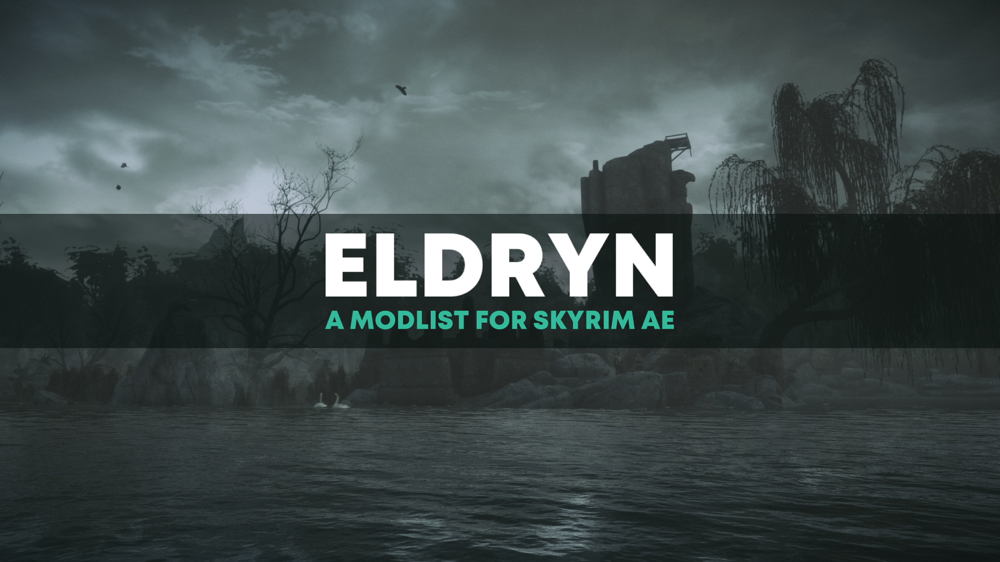

---

  <a href="https://www.nexusmods.com/skyrimspecialedition/mods/94412">Nexus Page</a> ·
  <a href="README.md">Installation Guide</a> ·
  <a href="PAGEFILE.md">Pagefile Setup</a> ·
  <a href="GAMEPLAY.md">Gameplay Guide</a> ·
  <a href="CONFIGURATION.md">Configuration Setup</a> ·
  <a href="CHANGELOG.md">Changelog</a> ·
  <a href="FAQ.md">Frequently Asked Questions</a> ·
  <a href="HELP.md">Help</a>

---

# Installation

- [Installation](#installation)
- [Introduction](#introduction)
  - [List Contents](#list-contents)
  - [Minimum Specs](#minimum-specs)
  - [Community](#community)
  - [Skyrim: Anniversary Edition (AE)](#skyrim-anniversary-edition-ae)
- [Installation](#installation-1)
  - [Pre-Install](#pre-install)
    - [Installing Microsoft Visual C++ Redistributable Package](#installing-microsoft-visual-c-redistributable-package)
    - [Steam Library](#steam-library)
    - [Set the Game language to English](#set-the-game-language-to-english)
    - [Clean Skyrim](#clean-skyrim)
    - [Start Skyrim](#start-skyrim)
  - [Using Wabbajack](#using-wabbajack)
    - [Preparations](#preparations)
    - [Downloading and Installing](#downloading-and-installing)
    - [Problems with Wabbajack](#problems-with-wabbajack)
    - [Pagefile in prevention of memory crashes](#pagefile-in-prevention-of-memory-crashes)
- [Updating](#updating)
- [Issues](#issues)
- [Credits](#credits)

# Introduction

Telsera is a **not-safe-for-work (NSFW)** modlist designed for **Skyrim Special Edition** with the **Anniversary Edition upgrade**. The legal age restriction may differ depending on your country of residence. Where I reside, adult actions are prohibited to those **at LEAST 18 years of age**. Please use discretion while playing, as there is nudity, graphic visuals, and sexual acts present within the pack. **YOU HAVE BEEN WARNED!**

The vision behind Telsera is primarily focused on performance-friendly visuals while retaining a consistent, stable, and engaging environment, as well as gameplay and mature narratives that don't stray too far from the game itself. Contents from the AE upgrade have been reintegrated, repurposed, or rebalanced depending on the creation. More information surrounding these changes can be found later in the readme under "Gameplay Guide."

(SFW) Highlights and Notes:

    Consistent texture combinations for an HD experience without needing a super-duper-ultra-powered computer. Examples include Tomato's Landscapes AIO, Skyland Bits and Bobs, Happy Little Trees, Freak's Flora Fields, etc.

    Modern lighting, water, and weather visuals to help tie in the atmosphere. Examples include Azurite Weathers III, Lux, Embers XD, Simplicity of Sea, etc.

    Fresh yet familiar environments through added structural details, clutter, and interest points. Examples include Spaghetti's Cities, Gorgeous Giant Camps AIO, Unmarked Locations Pack AIO, Ryn's Standing Stones, etc.

    Vanilla quest expansions, overhauls, and tweaks to rejuvinate veteran players from the same-old-same-old, while still retaining the vanilla feel for newcomers. Examples include House of Horrors - Quest Expansion, Save the Icerunner, Markarth - Help the Warrens, Thieves Guild Alternative Endings, etc.

    New locations and dungeons to lose yourself in, such as Extended Cut - Saints and Seducers, Hammet's Dungeons Packs 1 and 2, Lost Passages - New Dungeons, etc.

    You will NOT find giant new lands, cities, armor integration packs, new quests, and non-vanilla custom-voiced followers. There is an exception in some cases, however! Some of these EXCEPTIONS include Improved Follower Dialogue - Lydia, Gwenllian's Gift Shop, A Serious Wedding - Teldryn Sero Marriage, etc.

    Brand new animations from mod authors, including lSmoothl, Verolevi, CHIMgarden, Everglaid, and more!

    By default, Telsera uses an ENB mixture customized between Pi-CHO and Ominous.

(NSFW) Highlights and Notes:

    Telsera relies on nude, high-poly body replacers such as CBBE 3BA and HIMBO with tweaked presets for each one.

    Utilizes OStim Standalone (OStim SA) as a framework for adult animations and scenes. Animation packages include Lovemaking Compendium, Open Animations Romance and Erotica (OARE), Billyy's Animations for OStim SA, Nibbles' Animations for OStim SA, etc.

    Additional works are available to further enhance intimacy scenes, including OCum Ascended, OBottom, OStim Standalone Sound Overhaul (OSSO), etc.

    Encouragement to roleplay (not required of course!) experiences and relationship development. Examples include OStim Romance, You Got Caught for OStim SA, and OComfort - OStim Romance Fork.

    From a gameplay standpoint, you will NOT be able to bang every single NPC you come across right off the bat. Tweaks have been made to dialogue initiations, so you must have a relationship established with the NPC in question before you're able to attempt to be intimate with them. There are ways to bypass this mechanic for eager beavers, but that will be further explained later in the readme.

    By default, guards will break up public sexual encounters if you aren't careful. If you get caught in the act, beware, you may be fined!

    You will NOT find defeatist-themed NSFW mods in this pack. 

    You will NOT find skimpy armor replacers (well, except for one, but you have to find the needle in the haystack to find it).

## List Contents

You can browse the full list contents [here](https://loadorderlibrary.com/lists/eldryn-edition) if you want to know exactly what you're getting.

You can find a summary of all changes on the [Gameplay Changes](GAMEPLAY.md) page.

## Minimum Specs
Users have reported running the list fine with as low as a Ryzen 1300x and a GTX960. You may need to use performance ini files (included) with systems this low but it should run fine and still look great!

## Community

Support is offered in [The Lost Outpost](https://discord.gg/WF66mMu) server and in the [Issues](https://github.com/Lost-Outpost/eldryn/issues) section of the Eldryn GitHub. If you have any questions following the add-on's instructions or if you find a typo or any other mistake in the documentation, feel free to report in The Lost Outpost Discord server's support channel.

## Skyrim: Anniversary Edition (AE)

**This list requires anniversary edition and all creation club content.** Make sure your game is fully up to date in Steam. It will automatically be patched by Wabbajack to work out of the box, but requires the latest game files. You _must_ download all the creation club content before installing. This can be done by going in-game via Steam and downloading through the available CC-related Main Menu options.

# Installation

Installation is handled through [Wabbajack](https://www.wabbajack.org/#/) with a one-click install of the modlist. There are some pre-installation steps that must be followed for first-time users, so please pay attention to those.

## Pre-Install

These steps are only needed if you install the Modlist for the first time. If you are updating the Modlist, jump straight to [Updating](#updating).

### Installing Microsoft Visual C++ Redistributable Package

I doubt you need to do this since you likely already have this installed. This package is required for MO2 and you can download it from [Microsoft](https://support.microsoft.com/en-us/help/2977003/the-latest-supported-visual-c-downloads). Download the x64 version under "Visual Studio 2015, 2017 and 2019". [Direct link](https://aka.ms/vs/16/release/vc_redist.x64.exe) if you can't find it.

### Steam Library

If you have your Steam library in Program Files, read [this](https://github.com/LostDragonist/steam-library-setup-tool/wiki/Usage-Guide) to put it somewhere else.
I will not provide support to people with Skyrim in their Program Files folder.
Locations like Documents, Downloads, Desktop, or OneDrive are NOT fine. The best location would be `C:\SteamLibrary` if you have a single drive, or whichever Drive Letter you have on your main Games drive. Such a location is also called the "root of the drive."

### Set the Game language to English

Just do it. This entire Modlist is in English and 99% of all mods you will find are also in English. I highly recommend playing the game in English and **I will not give support to people with a non-English game**.

Open the Steam Properties window, navigate to the _Language_ tab, and select _English_ from the dropdown menu.

### Steam Updates

To prevent any mishaps when Todd Howard decides to drop another Skyrim update our way, we're going to turn off automatic updates for Skyrim SE. In Steam under the Library section on the left side, right-click The Elder Scrolls V: Skyrim Special Edition, then click Properties. Switch to the Updates tab, and at the top under 'Automatic Updates' switch the option to 'Only update this game when I launch it'. Exit out of the pop-up box once you're done.

### Clean Skyrim

I highly recommend uninstalling the game through Steam, deleting the game folder, and reinstalling it. You should also clean up the `Skyrim Special Edition` folder in `Documents/My Games/` by deleting the contents in it.

[THIS](https://imgur.com/a/1dySo8q) is approximately what a clean Skyrim install should look like after shredding or cleaning it manually.

### Start Skyrim
Start the game and exit once you're in the main menu. This will ensure any settings files needed by Wabbajack are created in the Skyrim directory.

## Using Wabbajack

### Preparations

Download the release to a _working folder_. This folder **must not** be in a _common folder_ like your Desktop, Downloads, or Program Files folder. It's best to create a Wabbajack folder near the root level of your drive like `C:/Wabbajack`.

Grab the latest release of Wabbajack from [here](https://github.com/wabbajack-tools/wabbajack/releases) and place the `Wabbajack.exe` file in the _working folder_.

### Downloading and Installing

The download and installation process can take a little while (an hour or more) depending on your system specs. Wabbajack will calculate the number of threads it will use at the start of the installation. To have the highest amount of threads and thus the fastest speed, it is advised to have the working folder on an SSD.

1. Create a folder for the List at the root of your drive (like the Wabbajack folder) called "Eldryn"
2. Go back to your drive, and create a new folder, called "Wabbajack Downloads Folder". This specific folder can be on a different drive if you wish.
3. Download the latest release of `Eldryn` from the Wabbajack Browse Modlists page.
4. Select the created folder in step 1 as your installation folder.
5. Select the created folder in step 2 as your downloads folder.
6. Click the Go/Begin button and wait for Wabbajack to finish.

## Using MO2

1. Once Wabbajack is finished, go into the folder where you installed Eldryn. You'll see an executable called ModOrganizer.exe. Launch it to get to the next step.

2. Once the program opens, look to the top right section and you should see a button that says Run.

3. Click that and you'll be set to play! **Do not click on the "Unlock" button that pops up once the game is running.** It may take a while to open, so please be patient.

### Problems with Wabbajack

There are a lot of different scenarios where Wabbajack will produce an error. I recommend re-running Wabbajack before posting anything. Wabbajack will continue where it left off so you lose no progress.

Seriously, simply retrying the Wabbajack download fixes most problems.

**Could not download x**:

If a mod updates and the old files got deleted, it is impossible to download them. In this case, just wait until I update the Modlist.

Some files are known to be problematic, it is likely those are the ones that failed. You can download them manually from their source and place the archives **AS IS** in the downloads folder.

**x is not a whitelisted download**:

This can happen when I update the modlist. Check if a new update is available and wait if there is none.

**Wabbajack could not find my game folder**:

Wabbajack will not work with a pirated version of the game. If you own the game on Steam, go back to the [Pre-Installation](#pre-installation) step.

### Pagefile in the prevention of memory crashes

Bigger Skyrim modlists need a lot of memory, and when there is not enough available it may fail to allocate more. To fix this, you'll want to have a bigger <a href="PAGEFILE.md" target="_blank">pagefile</a>.

# Updating

If this Modlist receives an update, please check the [changelog](CHANGELOG.md) before doing anything. Always back up your saves or start a new game after updating.

**Wabbajack will delete all files that are not part of the Modlist when updating!**

This means that any additional mods you have installed on top of the Modlist will be deleted. Your saves will be kept, but please check each update changelog to see if the update is save-compatible. Your downloads folder will not be touched!

Updating is like installing. You only have to make sure that you select the same path and tick the _overwrite existing Modlist_ button.

# Issues

If you find an issue, you can see if it is already on the list of [known issues](HELP.md), which also documents solutions and workarounds.

For issues that aren't yet [known](HELP.md), you can provide details in the [Eldryn Github](https://github.com/Lost-Outpost/eldryn/issues). Please provide as much info as you can (screenshots are great).

Finally, free feel to hop on the Eldryn Discord support channel to have discussions with our knowledgeable community members. Support is offered in [The Lost Outpost](https://discord.gg/WF66mMu).

# Eldryn Team
+ Foamimi
